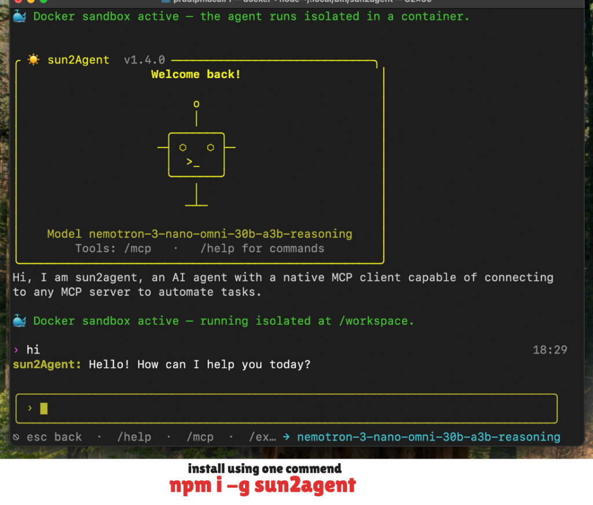

<div align="center">

# ☀️ sun2Agent

**Your terminal. Your MCP servers. One safe AI agent.**

A fast, security-hardened AI agent that lives in your terminal — connects to any
[Model Context Protocol](https://modelcontextprotocol.io) server, calls tools
automatically, and runs 5 layers of guardrails on every call.

[](https://www.npmjs.com/package/sun2agent)
[](https://www.npmjs.com/package/sun2agent)
[](https://nodejs.org)
[](LICENSE)
[](#guardrails)

[Install](#install) · [Quick Start](#quick-start) · [MCP Servers](#connecting-mcp-servers) · [Docker Sandbox](#docker-sandbox-optional) · [Guardrails](#guardrails) · [Context (AGENT.md)](#repository-instructions-agentmd) · [Memory](#local-memory-optional)

</div>

<p align="center">
  
</p>

```
› Go to example.com, inspect the page, take a screenshot,
and click the More information link
  ⚙ playwright__browser_navigate({"url":"https://example.com"})
  ⚙ playwright__browser_take_screenshot()
  ⚙ playwright__browser_click({"selector":"a"})...
sun2Agent: The page is a minimal placeholder titled "Example Domain"…

› read my AGENT.md and run the test suite the way it says
  ⚙ filesystem__read_file({"path":"AGENT.md"})
  ⚙ filesystem__run_command({"cmd":"npm test"})
sun2Agent: Test suite complete — following your AGENT.md instructions.
```
## Why sun2Agent

Most MCP clients bury the agent inside a heavy editor or desktop app. sun2Agent is
**just a terminal** — start it, point it at your MCP servers, and ask for things in
plain language. The agent figures out which tools to call.

|  | Feature |
|---|---|
| 🔌 | **Native MCP client** — `stdio`, `http` (Streamable HTTP), and `sse` transports, local or remote |
| 🧰 | **One server or all at once** — connect everything and let the model pick the right tool |
| ⚙️ | **Automatic tool-calling** — no tool syntax to memorize, just describe the task |
| 🛡️ | **5-layer guardrails** — destructive commands, exfiltration, credential files, and secret leaks are blocked before anything runs |
| ✋ | **Human-in-the-Loop (HITL)** — interactive per-session tool call approval (`Allow` / `Don't allow`) before any proposed tool executes |
| 🐳 | **Optional Docker sandbox** — run the entire agent isolated in a container, with automatic session resume when Docker restarts |
| 🧠 | **Local preference memory (`memory.md`)** — retain explicit user preferences across sessions with local search; zero telemetry or external API calls |
| 📄 | **AGENT.md support** — drop an `AGENT.md` in your project and the agent follows your repo's conventions |
| 📊 | **LangSmith observability** — opt-in tracing of LLM calls and tool execution, sanitized before it leaves your machine |
| 🎛️ | **Any NIM model** — Llama, GPT-OSS, Nemotron… swap anytime with `/config` |
| ⌨️ | **Calm TUI** — rounded input box, live connection tags, `Esc` interrupts anything |

## Install

> **Recommended — install sun2Agent globally so it is available in every terminal.**

```bash
npm install -g sun2agent
```

Then launch it anywhere:

```bash
sun2agent
```

<details>
<summary>Prefer not to install globally?</summary>

Run the latest release on demand instead:

```bash
npx sun2agent
```
</details>

**Requirements:** Node.js 18 or newer and an NVIDIA NIM API key.

> [!NOTE]
> Do not run `npm install sun2agent` inside another project. Use `-g` above or `npx sun2agent`; installing it locally can trigger unrelated dependency resolution errors in that project.

## Quick Start

Your first useful tool call takes four short steps:

```text
1. sun2agent       Start the agent
2. /config         Add an NVIDIA NIM API key and choose a model
3. /mcp            Add and connect an MCP server
4. Ask naturally    “Read AGENT.md and run the tests”
```

Get an API key from [NVIDIA Build](https://build.nvidia.com): choose a model, then select **Get API Key**. Keys begin with `nvapi-`.

When a connected MCP tool is needed, sun2Agent shows the proposed call and asks:

```text
Allow this MCP tool call?
Allow — Don't allow
[Enter] Allow    [Esc] Don't allow
```

An allowed tool is remembered only for the current chat session; a denied call is skipped.

---
## Commands

| Command | Action |
|---------|--------|
| `/help`, `/?` | Show all commands and shortcuts |
| `/config` | Set your NVIDIA NIM API key and choose a model |
| `/mcp` | Manage MCP servers — add/edit, connect one or all, disconnect |
| `/agent` | Open the project's AGENT.md in your editor (creates a template on first use) |
| `/memory` | Open and edit local `~/.sun2agent/memory.md` |
| `/delete` | Delete saved config and data |
| `/exit` | Quit |

| Key | Action |
|-----|--------|
| `Enter` | Send message |
| `Esc` *(while typing)* | Clear the input |
| `Esc` *(empty box)* | Disconnect MCP, return to simple chat |
| `Esc` *(agent working)* | Stop the current reply or tool call |
| `Esc` *(in menus)* | Go back / cancel |
| `Ctrl+C` | Quit immediately |

## Connecting MCP servers

**1. Open the config.** Run `/mcp` → **Add / Edit MCP**. This opens `~/.sun2agent/mcp.json` in your editor.

**2. Add servers** under `mcpServers`:

```json
{
  "mcpServers": {
    "filesystem": {
      "type": "stdio",
      "command": "npx",
      "args": ["-y", "@modelcontextprotocol/server-filesystem", "/tmp"]
    },
    "playwright": {
      "type": "stdio",
      "command": "npx",
      "args": ["-y", "@playwright/mcp@latest"]
    },
    "my-http-server": {
      "type": "http",
      "url": "https://your-server.example.com/mcp",
      "headers": { "AUTHORIZATION": "Bearer YOUR_KEY" }
    },
    "my-sse-server": {
      "type": "sse",
      "url": "https://your-server.example.com/sse"
    }
  }
}
```

| `type` | Transport | Needs |
|--------|-----------|-------|
| `stdio` | Local child process | `command`, optional `args` / `env` |
| `http` | Streamable HTTP (alias: `remote`) | `url`, optional `headers` |
| `sse` | Server-Sent Events | `url`, optional `headers` |

Set `"enabled": false` on any server to skip it without deleting it.

**3. Connect.** Run `/mcp` → **Connect MCP**, then pick a server — or **Connect all MCPs** to load every server at once.

The active server appears as a green `@tag` under the input box (`@allMcps` when several are connected), and its tools are available to the agent immediately.

## Docker sandbox (optional)

Run the **entire agent** — chat loop, guardrails, LLM calls, MCP client — inside an
isolated container. Only your project directory and the agent's own config are
visible; nothing else on your machine is reachable.

```bash
sun2agent sandbox enable     # turn it on (checks Docker first)
sun2agent sandbox status     # see current mode
sun2agent sandbox disable    # back to running on the host
```

- **No silent fallback.** If Docker is installed but not running, sun2Agent tells
  you and exits — it never quietly runs unsandboxed on your host.
- **Survives outages.** Your conversation is saved after every exchange. If Docker
  stops mid-session, the agent waits for it to come back and resumes exactly where
  you left off.
- **Root is refused.** Launching from `/` (which would expose your whole machine)
  is blocked with a clear message.

## Repository Instructions (AGENT.md)

sun2Agent reads project-specific instructions from an `AGENT.md` file in the
directory you launch from — your conventions, stated once, followed every prompt.

Type `/agent` in the chat to open (or create) it. On first use a template is
generated for you:

```markdown
# Project Instructions

- Use JavaScript.
- Use npm.
- Run npm test after changes.
- Follow the existing project structure.
```

The file is appended to the system prompt as clearly-labelled advisory context. If
`AGENT.md` does not exist, sun2Agent behaves exactly as before.

> [!IMPORTANT]
> **AGENT.md is advisory only.** It cannot override, disable, or bypass sun2Agent's guardrails. The guardrails run on entirely separate code paths (user prompts, tool arguments, tool output) and are not affected by system-prompt text.

## Local memory (optional)

Enable memory from `/config` to let sun2Agent retain explicit preferences between sessions. Memory lives locally and makes no model, embedding, telemetry, or memory-service requests.

- Editable memories live in `~/.sun2agent/memory.md` (stored as JSON inside the `.md` file).
- A stable anonymous installation UUID lives in `~/.sun2agent/user-id`.
- `/memory` opens `memory.md` even when automatic memory is disabled.
- Local keyword relevance selects up to five memories; the full file is never injected.
- Explicit phrases such as “remember that…”, “I prefer…”, and “always…” can be saved automatically.
- Memory is contextual only and cannot override AGENT.md, guardrails, security policy, or Docker restrictions.

## LangSmith observability

Optionally trace LLM calls and MCP tool execution with LangSmith:

1. Run `/config`.
2. After choosing a model, answer `Yes` to **Enable LangSmith observability?**.
3. Paste your LangSmith API key when prompted.

Key points:

- **Off by default.**
- Traced content is **sanitized with the output guard** before it is sent — API keys and tokens are masked, never uploaded.
- LangSmith credentials are stored in `~/.sun2agent/config.json` with owner-only permissions.
- Disable any time by re-running `/config`.

## Guardrails

Because MCP tools run automatically on the model's say-so, every call passes
through five layers of guards first. Plain pattern matching — no extra model
calls, no network activity, no measurable latency.

```
User prompt ──▶ inputGuard ──▶ LLM ──▶ tool call
                                          │
                    commandGuard ──▶ networkGuard ──▶ filesystemGuard
                                          │
                                    Execute tool
                                          │
                                     outputGuard ──▶ Terminal

System prompt = base persona + MCP tool list + AGENT.md (advisory only)
```

| Guard | Blocks |
|-------|--------|
| **inputGuard** | Prompt injection, jailbreaks, system-prompt extraction |
| **commandGuard** | `rm -rf`, `sudo`, `mkfs`, `dd if=`, fork bombs, `curl … \| sh`, reverse shells, `git push --force` |
| **networkGuard** | Data exfiltration (`cat .env \| curl`), uploads (`curl -d`, `scp`, `nc`) |
| **filesystemGuard** | `.env`, `.ssh`, `.aws`, `id_rsa`, `*.pem`, path traversal, anything outside the project root |
| **outputGuard** | Masks API keys, AWS/GitHub/Slack tokens, JWTs, private keys in tool output |

A blocked call fails with a clear reason and is reported back to the model, which can then try a safe alternative.

All policy lives in [`src/guardrails/guardConfig.js`](src/guardrails/guardConfig.js) — edit that one file to tighten or relax the rules. Notable knobs:

- `projectRoot` — the filesystem sandbox. Defaults to the directory you launched from, so **start sun2Agent inside the project you want the agent working on.** File arguments pointing outside it are refused.
- `strictDomains` — off by default. Turn it on to restrict outbound URLs to `allowedDomains`.

Run the full test suite (Node's built-in test runner; no test dependencies):

```bash
npm test
```

## Security & trust

- **Your keys stay local.** The API key and `mcp.json` live in `~/.sun2agent/` with owner-only permissions, and are never bundled with the package.
- **MCP child processes get a clean environment.** Only a safe allowlist of variables (`PATH`, `HOME`, …) is passed to stdio servers — your API keys never leak into child processes.
- **`mcp.json` can launch programs.** A `stdio` server runs whatever `command` you give it — treat the file like a shell script and only add servers you trust.
- **Guards reduce risk; they don't eliminate it.** They match known-dangerous patterns, so a novel phrasing can get through. Stay careful when a session mixes servers that read untrusted web content with servers that can take destructive actions.
- **AGENT.md is advisory only** and cannot modify, disable, or bypass any guardrail.

## Troubleshooting

**Tools are listed but the model never calls them**
Some models tool-call more reliably than others. Try a different model with `/config`, or name the tool explicitly in your prompt.

**`/agent` doesn't open the file**
Make sure you're running the latest version. If you edited the source locally, run `npm link` from the project directory so the global `sun2agent` command points at your working copy.

## Uninstall

```bash
sun2agent delete            # optional: remove saved config + mcp.json
npm uninstall -g sun2agent
```

## License

MIT
